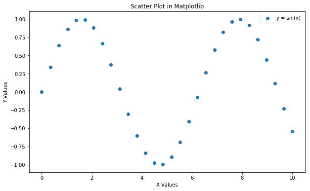
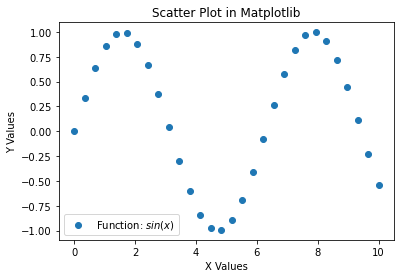
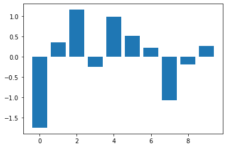
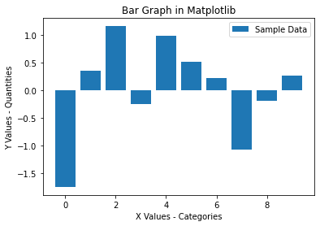
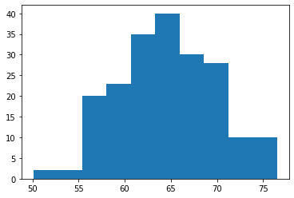
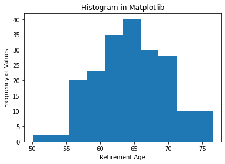
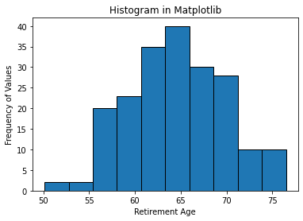
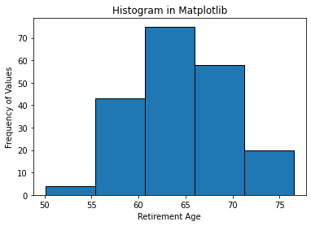
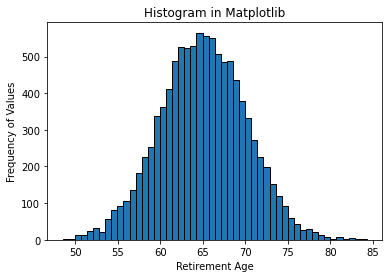

# Data Visualization

## Introduction

This lesson introduces data visualization using Python and the popular Matplotlib plotting library. You will explore the fundamental features of Matplotlib plots and how to use them for creating and labeling visualizations. 

## Objectives
You will be able to:
* Understand the purpose of scatter plots, bar graphs, and histograms
* Use Matplotlib to create plots

## Data Visualization with Python

In a traditional math class, data visualization looks something like this:

<a title="Asimzb, CC BY 3.0 &lt;https://creativecommons.org/licenses/by/3.0&gt;, via Wikimedia Commons" href="https://commons.wikimedia.org/wiki/File:TI-84_Plus_graphing.jpg"></a>

With Matplotlib, it looks something like this:


From Matplotlib's [website](https://matplotlib.org/index.html):

> Matplotlib makes easy things easy and hard things possible.

In this lesson we'll be showing you a lot of new syntax, reviewing some of the most essential types of plots, and demonstrating how to create them with Matplotlib.

## Matplotlib Plotting Library

The Matplotlib plotting library provides a range of built in functions to start visualizing data with minimal effort. 

First, import `matplotlib`'s `pyplot` module (a module is a unit of prewritten code that you can use in your projects) into your working environment. We will use the standard alias of `plt` for `pyplot`.

In Jupyter notebooks, you can use the `%matplotlib` "magic command" with `inline` to show plots inside the notebook or `qt` for external plots. The `inline` option is recommended for most requirements (external plots are suitable for interactive visualizations).  


```python
# Import pyplot for plotting
import matplotlib.pyplot as plt

%matplotlib inline
```

Before we actually plot any data, let's set up a *figure* named `fig` and an *axes* named `ax`. By default, it will show an empty plot with X and Y axes ranging from 0 to 1.

(Yes, the term in Matplotlib is "an axes", we know it's a bit odd to say! We'll cover more of the features of the figure vs. the axes in a future lesson on customizing visualizations.)


```python
fig, ax = plt.subplots()
```


## NumPy for Generating Dummy Data

We will use `numpy` (one of the most popular Python libraries for scientific computing) to create some sample data. NumPy provides useful tools for generating dummy data for visualizations, but don't worry too much about the NumPy code here — NumPy is being used as a teaching tool to help you learn to use Matplotlib.

Let's start by creating two NumPy arrays:

 - `x`: an array of 30 equally spaced data points on a line space of 0 - 10
 - `y`: an array representing $sin(x)$


```python
# Import numpy to generate some dummy data
import numpy as np

x = np.linspace(0, 10, 30)
y = np.sin(x)

print("x:", x)
print("y:", y)
```

    x: [ 0.          0.34482759  0.68965517  1.03448276  1.37931034  1.72413793
      2.06896552  2.4137931   2.75862069  3.10344828  3.44827586  3.79310345
      4.13793103  4.48275862  4.82758621  5.17241379  5.51724138  5.86206897
      6.20689655  6.55172414  6.89655172  7.24137931  7.5862069   7.93103448
      8.27586207  8.62068966  8.96551724  9.31034483  9.65517241 10.        ]
    y: [ 0.          0.33803442  0.6362712   0.85959818  0.98172251  0.9882662
      0.87845883  0.6652283   0.37367879  0.03813513 -0.30189827 -0.60638843
     -0.83948697 -0.9737506  -0.99337213 -0.89604148 -0.69321762 -0.40877952
     -0.07621478  0.26532292  0.57562349  0.81815446  0.96436206  0.9970329
      0.91232056  0.72019844  0.44328555  0.11418355 -0.22836157 -0.54402111]


Well, that's enough numbers that we need a plot to help make sense of it! Let's get started.

## Scatter Plots

### What Are Scatter Plots?

A scatter plot is a two-dimensional data visualization that uses individual data points to represent the values obtained for two different variables - one plotted along the x-axis and the other plotted along the y-axis. 

Scatter plots are used when you want to show the relationship between two variables. Scatter plots are sometimes called correlation plots because they show how two variables are correlated.

### Scatter Plots in Matplotlib

The following code shows the simplest possible scatter plot with our `x` and `y` variables, using the `scatter` method ([documentation here](https://matplotlib.org/api/_as_gen/matplotlib.axes.Axes.scatter.html#matplotlib.axes.Axes.scatter)):


```python
# Create the plot
fig, ax = plt.subplots()

# Graph X vs. Y as a scatter plot
ax.scatter(x, y); # ; at the end suppresses unwanted output and is optional
```





Great! But it's missing a title and labels. We'll get into some more plot customization later, but it's important that **every plot you make** is appropriately labeled.

Let's add:

 - Plot title
 - Labels for X and Y axes
 - Legend


```python
# Create the plot
fig, ax = plt.subplots()

# Graph X vs. Y as a scatter plot
ax.scatter(x, y)

# Set title
ax.set_title("Scatter Plot in Matplotlib")

# Set labels for X and Y axes
ax.set_xlabel("X Values")
ax.set_ylabel("Y Values")

# Set text of legend
ax.legend(["Function: $sin(x)$"]); # the dollar signs mean this is mathtext: https://matplotlib.org/tutorials/text/mathtext.html
```





The nice thing is labels and other customizations that you see here are applicable to almost all kinds of plots in Matplotlib. 

## Bar Graphs

### What Are Bar Graphs?

Bar graphs (also called "bar charts") are one of the most common plot types for showing comparisons across data. Bar graphs allow comparisons across categories by presenting categorical data as rectangular bars with heights or lengths proportional to the values that they represent. One axis of the graph shows the specific categories being compared and the other axis represents a value scale. The bars can be plotted vertically or horizontally. When the bars are plotted vertically, it is usually referred to as a "column graph." Some examples of bar graphs are shown below.


### Bar Graphs in Matplotlib

Matplotlib features a number of handy plotting functions. Matplotlib's `.bar()` and `.barh()` functions can be used to draw constant width vertical and constant height horizontal bar graphs for a simple sequence of x, y values. 

Before coding these graphs, first we'll generate some new `x` and `y` data using functions from the `np.random` module. This is a specialized module within NumPy for generating random numbers. Again, don't worry if the code seems unfamiliar now, `numpy` is not the emphasis of this lesson.


```python
# Set seed for reproducibility
np.random.seed(100)

# Generate the x-axis variable as 10 categories using numpy's arange function
x = np.arange(10)

# For y-axis, generate 10 random quantities
height = np.random.randn(10)
```

Now, plot a simple bar graph using the above data and the `.bar()` function ([documentation here](https://matplotlib.org/api/_as_gen/matplotlib.axes.Axes.bar.html#matplotlib.axes.Axes.bar)).


```python
# Create the plot
fig, ax = plt.subplots()

# Graph X vs height as a bar graph
ax.bar(x, height);
```





Again, let's make sure we add appropriate labels:


```python
# Create the plot
fig, ax = plt.subplots()

# Graph X vs height as a bar graph
ax.bar(x, height)

# Set title
ax.set_title("Bar Graph in Matplotlib")

# Set labels for X and Y axes
ax.set_xlabel("X Values - Categories")
ax.set_ylabel("Y Values - Quantities")

# Set text of legend
ax.legend(["Sample Data"]);
```





That bar graph above is useful because you can easily inspect the quantities in each category (0-10) and make informed decisions about how data are distributed across these categories. 

##  Histograms 

### What Are Histograms?

A histogram is a plot that lets you discover the underlying frequency distribution of a data set. It allows you to visualize fundamental properties about the data like if it is skewed in any particular direction or if it has outliers. An example of a histogram of the ages of people is shown below:


Basically, histograms are used to represent data that has been split into some number of groups. The x-axis describes the groups and the y-axis describes the frequency of occurrence. If this is a little confusing, consider the histogram of ages above. The x-axis shows ages in groups of 10 years. The y-axis is a count of how many times a member from each group appears in the data. For example, there are 2 occurrences of ages between 20-30.

It is important to distinguish bar graphs from histograms. Bar graphs show category-specific values and consist of two variables. Histograms show counts of how frequently a given range of values occurs in a data set. Take a look at the examples below and think about how they are different: 

<br>

<br>

### Histograms in Matplotlib

You can use the `.hist()` function in Matplotlib to draw a histogram while passing in values from the required data variable. Say you want to plot a histogram of the retirement ages of 200 people. First we'll generate some dummy data:


```python
# Set seed for reproducability
np.random.seed(100)

# Generate a data set of 200 retirement age values
x = 5*np.random.randn(200) + 65
```

Notice that we did not generate a `y` or `height` value here. A histogram represents the distribution of a *single variable*, unlike scatter plots and bar graphs which represent information about *two related sets of variables*.

Now let's plot the histogram ([documentation here](https://matplotlib.org/api/_as_gen/matplotlib.axes.Axes.hist.html#matplotlib.axes.Axes.hist)):


```python
# Create the plot
fig, ax = plt.subplots()

# Graph the distribution of X
ax.hist(x);
```





Again, let's add labels:


```python
# Create the plot
fig, ax = plt.subplots()

# Graph the distribution of X
ax.hist(x)

# Set title
ax.set_title("Histogram in Matplotlib")

# Set labels for X and Y axes
ax.set_xlabel("Retirement Age")
ax.set_ylabel("Frequency of Values");
```





Recall, the y-axis tells you how often a certain range of numbers appears in the data set. From the histogram (interpreting these dummy numbers as though they were real), you can see that there are a lot of people who retire around 65. There are significantly fewer people who retire at 75 and even fewer people who retire at 50.

### Customizing Histograms: The `bins` Argument

We will cover much more about customizing plots later, but for now there is one key customization specific to histograms: the `bins` argument.

In the plot above, there are 10 bins (groups) of ages represented. It's clearer to see if we set the `edgecolor` argument:


```python
# Create the plot
fig, ax = plt.subplots()

# Graph the distribution of X with black edges
ax.hist(x, edgecolor="black")

# Set title
ax.set_title("Histogram in Matplotlib")

# Set labels for X and Y axes
ax.set_xlabel("Retirement Age")
ax.set_ylabel("Frequency of Values");
```





Check out what happens when you change the number of bins to 5:


```python
# Create the plot
fig, ax = plt.subplots()

# Graph the distribution of X with black edges and 5 bins
ax.hist(x, edgecolor="black", bins=5)

# Set title
ax.set_title("Histogram in Matplotlib")

# Set labels for X and Y axes
ax.set_xlabel("Retirement Age")
ax.set_ylabel("Frequency of Values");
```





Note the scale of the y-axis and the width of the bars compared to the histogram using 10 bins. The granularity of the bins can be changed according to your specific analytical needs and the amount of data available. For example, if you had 50 data points, you would not want to use 500 bins.  

For the final example, say you got a much larger data set of 10000 retirement ages.


```python
# Generate a data set of 10000 retirement age values
np.random.seed(100)
x = 5*np.random.randn(10000) + 65

# Plot the histogram with black edges and 50 bins
fig, ax = plt.subplots()
ax.hist(x, edgecolor="black", bins=50)

ax.set_title("Histogram in Matplotlib")
ax.set_xlabel("Retirement Age")
ax.set_ylabel("Frequency of Values");
```





Notice that the shape of the distribution begins to look more bell-shaped as the size of the data set increases. This is characteristic of an important distribution known as the "Normal" distribution which you will learn more about later.


## Summary

In this lesson, you learned how to use Matplotlib's basic plotting techniques to visually describe your data as scatter plots, bar graphs, and histograms. You also identified use cases for each of these techniques and learned how to add basic details to a plot. 
