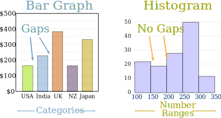

# Data Visualization

## SWBAT:
* Understand matplotlib plot structure for drawing basic plots.
* Visualize data using scatterplots, barplots and histograms


## Introduction

This lesson covers the basics of data visualization with Python and `matplotlib` plotting library. We shall look into the components of standard matplotlib plots, used for creating and customizing visualizations. The set of skills learnt in this lesson are considered to be of high importance in the domains of data visualization and visual analytics


## `matplotlib` :

The `matplotlib` plotting library provides a range of built in functions to start visualizing data with minimum effort. 

Let's first import matplotlib's `pyplot` module into our working environment along with `numpy` to create sample data.`pyplot` module provides allows simple and agile creation of figures and axes to achieve the desired plot. We shall see below how required figure descriptions and axes are added in a simple example. 

Following import statement must be provided before using matplotlib.

```python
import matplotlib.pyplot as plt

```

In jupyter notebooks, you can use `%matplotlib` magic with `inline` to show plots inside the notebook or `qt` for external/interactive plots. `inline` is recommended for most needs.  


```python
# Import matplotlib
import matplotlib.pyplot as plt

# Set plot space as inline for inline plots and qt for external plots
%matplotlib inline
```

We can use python's `numpy` library to create sample data (numppy will be covered in detail in unit 3). Let's use [numpy's `linspace()` function](https://docs.scipy.org/doc/numpy-1.14.5/reference/generated/numpy.linspace.html) to quickly generate some dummy data for visualizations.


```python
# Import numpy to generate some dummy data
import numpy as np

# Create a numpy array of 100 values from 0 - 1000
x = np.linspace(0, 1000, 100)
y = np.linspace(0, 100, 100)

# Uncomment below to view the data
# print(x)
# print(y)
```

### Scatter plot

A scatter plot is a two-dimensional data visualization that uses dots to represent the values obtained for two different variables - one plotted along the x-axis and the other plotted along the y-axis. 

Scatter plots are used when you want to show the relationship between two variables. Scatter plots are sometimes called correlation plots because they show how two variables are correlated. 

A method of creating scatter plots is the `plt.scatter()` function which can take in two vectors and shows their relationship. We can optionally pass in extra parameters like `label` to provide information to the plot, `plt.title()` for defining a title and `plt.legend()` to add this context information to the plot, and finally `plt.show()` functions to output the plot.


```python
# Pass in x and y values with a label 
plt.scatter(x, y, label = "Sample Scatter Plot" )
plt.title('Scatter Plot in Matplotlib')
plt.legend()
plt.show()
```


SO above shows a linear relationship between variables. Still a bit hard to read ? We we can customize the plot to make it easier to read as below:

We can provide labels for both axes in the above chart by using `plt.xlabel` and `plt.ylabel`. We can also change the size of the plot with `plt.figure(figsize=(a,b))`, where a and b are inches for width and height of the plot. Let's see this in action below:


```python
# Set the figure size in inches
plt.figure(figsize=(10,6))

plt.scatter(x, y, label = "Sample Scatter Plot" )

# Set x and y axes labels
plt.xlabel('X values')
plt.ylabel('Y values')

plt.title('Scatter Plot in Matplotlib')
plt.legend()
plt.show()
```


So the above scatter chart shows a straight line i.e. a true linear relationship between the variables. Remember, labeling and other customizations that you see here are applicable to almost all kids of plots in matplotlib as we shall see ahead. 

### Bar Graph or Column Graph.

Bar charts are one of the most common plot types for showing comparisons between data elements. A bar chart or column graph allows comparisons across categories by presenting categorical data as rectangular bars with heights or lengths proportional to the values that they represent. One axis of the chart shows the specific categories being compared and the other axis represents a discrete value scale. The bars can be plotted vertically or horizontally.


Matplotlib comes packaged with a number of handy plotting functions. Matplotlib's `.bar()` and `.barh()` methods can be used to draw constant width vertical and constant height horizontal bar graphs for a simple sequence of x, y values. Let's plot a simple vertical bar graph with `.bar()` function. In the above example, we had the same number of values in both x and y. Let's generate some more data in numpy for plotting first. 


```python
# Set seed for reproducability
np.random.seed(100)

# Generate variable x with with 10 categories using numpy's arange function for x-axis
x = np.arange(10)

# For y-axis, generate 10 random quantities from the “standard normal” distribution (zero mean) 
# using numpy's random.randn() function
y = np.random.randn(10)
```

Now let's plot a bar graph based on above data.


```python
plt.figure(figsize=(10,6))

# Use bar() function to create a plot using above values on both x and y co-ordinates. Add a label.
plt.bar(x, y, label='Sample Data')

plt.xlabel('X values - categories')
plt.ylabel('Y values - quantities')

plt.title('Bar Plot in Matplotlib')
plt.legend()

# Output the final plot
plt.show()
```


With such a bar graph, we can easily inspect the quantities in each category (0-10) and make informed decisions about data distribution in these categories. 

###  Histograms 

A histogram is a plot that lets you discover the underlying frequency distribution of a set of continuous data. This allows the inspection of the data for its underlying distribution (e.g., normal distribution), outliers, skewness, etc. An example of a histogram, and the raw data it was constructed from, is shown below:


Basically, histograms are used to represent data given in form of some groups. X-axis is about bin ranges where Y-axis talks about frequency. So, if you want to represent age wise population in form of graph then histogram suits well as it tells you how many exists in certain group range or bin, if you talk in context of histograms.

Bars Charts are distinguished from Histograms, as they do not display continuous developments over an interval. Bar Chart's discrete data is categorical data and therefore answers the question of "how many?" in each category.



A histogram can be created with matplotlib using `plt.hist()`. Let's generate some random integers in numpy using:
> `x = np.random.random_integers(1, 100, 5)`

Here, we take a range of integers from 1 -100, the first parameter is lowest, 2nd parameter is for highest and the last one is for how many numbers should return between 1 and 100. Every time it will return 5 random numbers between the range. Therefore, the histogram will vary every time you execute this code.


```python
x = np.random.randint(1, 100, 5)
plt.hist(x, bins = 10)
plt.ylabel('No of times')
plt.title('Histograms in matplotlib')
plt.show()
```


Y-axis tells about the frequency a certain number appears in data set. Since this data was random thus probability of appearing a number will not be more than once most of the time.

we can optionally pass the `bins` argument to describe the width the slot or range, in our case it is 10 that is, whatever 5 values will be generated via `randomint` will be divider by bin value and get plotted. Let's say we change it to 5 below.


```python
plt.hist(x, bins = 5)
plt.ylabel('No of times')
plt.title('Histograms in matplotlib')
plt.show()
```


## Summary

In this lesson, we learnt how to use matplotlib's basic plotting techniques to visually describe our data. We also identified use cases for each of these techniques and learnt how to customize and add basic details to a plot. 
